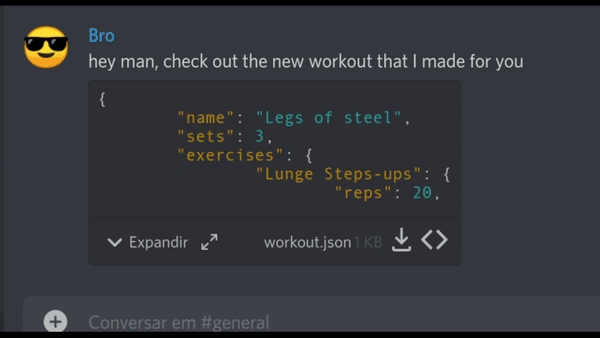

# Web-Workout
Web Workout is an open source web app that allows you to convert json files into practicable workouts.
The idea is to make easy to share your custom workout program to friends just by sending them a json file.

[<h2>Interested? Check it out!</h2>](https://webworkout.netlify.app)
